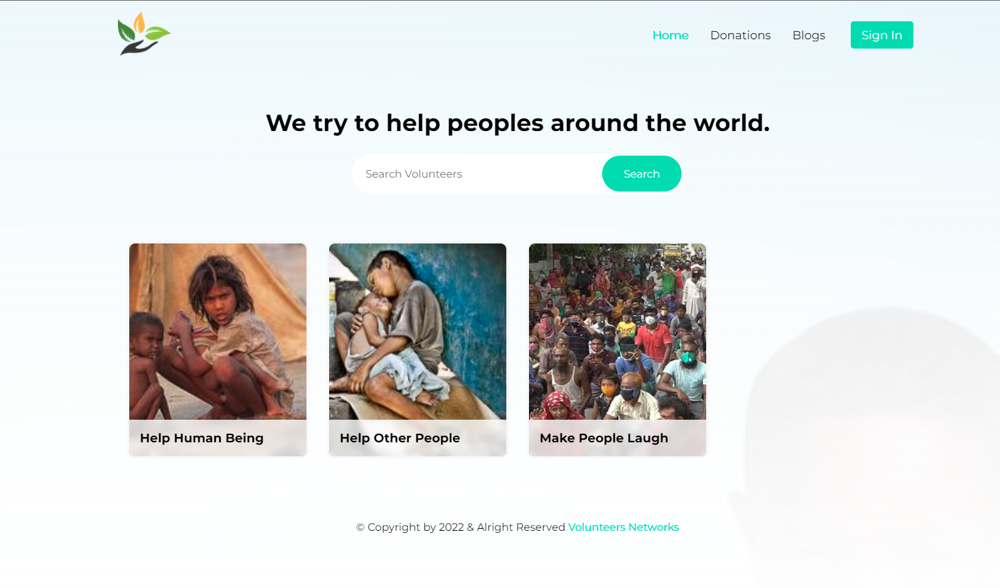

# Volunteer Application

This is volunteers application and here we can fake donate helpless people and create account to handle blog, events and much more. If you have any query about this project feel free to share with me.

## Using Technologies

---

### Front-end

- React js
- firebase
- react-router-dom
- styled-components
- react-toastify
- sweetalert2
- axios

### Back-end

- cors
- dotenv
- express
- jsonwebtoken
- mongodb

## Required Features

---

- user can create an account using google account and also can create him own account using email password and few information
- user can donate helpless people without login
- after login user can create him own blog and manage like edit delete and muted as well
- after login user also can manage him own events when he set to go donate people and make a event for helpless people and also manage as well something like blog

- admin can manage all the volunteers or users can muted and delete as well
- user can search of events without login
- this api is secured by json web token

---

## Live link on about Or [Click Here](https://volunteers-app-5f121.web.app/)

---

## Demo Preview of This Application

> Thanks for reach out me on github.
